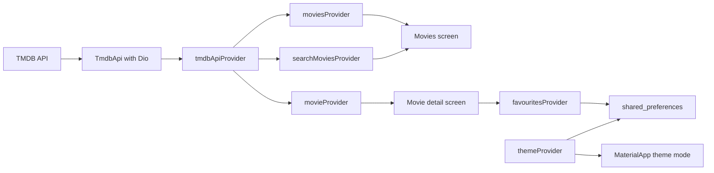

<div align="center">

# TMDB Movie Browser

A polished Flutter movie discovery app powered by The Movie Database API.
Browse popular titles, search with debounce, open cinematic detail pages, and keep favourites locally.


</div>

## Overview

TMDB Movie Browser is a cross-platform Flutter app that demonstrates a clean, testable approach to API-driven UI. It uses Riverpod for state management, Dio for networking, and `shared_preferences` for persisted favourites and theme preference.

The experience focuses on the flows a movie browser should feel good at: fast search, infinite popular-movie pagination, smooth poster cards, detail pages with backdrop artwork, and a favourites list that survives app restarts.

## Features

| Experience | Details |
| --- | --- |
| Movie discovery | Popular movies with pull-to-refresh and infinite scroll pagination. |
| Search | Debounced title search backed by TMDB search results. |
| Details | Poster hero animation, backdrop image, rating, release year, genres, and overview. |
| Favourites | Add/remove movies and persist them locally with `shared_preferences`. |
| Theme | System, light, and dark theme cycling with saved preference. |
| Loading states | Shimmer placeholders and clear empty/error states. |
| Tests | Unit coverage for movie loading/pagination and widget coverage for card layout. |

## Screenshots

Live screenshots are optional, but they make the project stand out in a portfolio or pull request. Add final captures under `docs/screenshots/` once the app is running with your TMDB credentials.

Suggested capture set:

| Screen | Recommended file | What to show |
| --- | --- | --- |
| Movies | `docs/screenshots/movies.png` | Popular list, search field, poster cards. |
| Details | `docs/screenshots/details.png` | Backdrop, poster hero, metadata, favourite button. |
| Favourites | `docs/screenshots/favourites.png` | Saved movies and remove action. |
| Demo clip | `docs/screenshots/demo.mp4` | Search, open details, add/remove favourite. |

After adding screenshots, include them near this section:

```md


```

## Tech Stack

| Layer | Choice | Why it fits |
| --- | --- | --- |
| Framework | Flutter | One codebase for Android, iOS, web, desktop, and tests. |
| State | `flutter_riverpod` | Explicit dependencies, test-friendly overrides, and clean async state. |
| Networking | `dio` | Concise HTTP client with headers, query parameters, and response handling. |
| Config | `flutter_dotenv` plus `--dart-define` fallback | Local development stays simple while CI/release builds can inject secrets. |
| Persistence | `shared_preferences` | Lightweight storage for favourites and theme mode. |
| Images | `cached_network_image` | Poster/backdrop caching with placeholders and error states. |
| Loading UI | `shimmer` | Polished skeleton states while movie data loads. |

## State Management

This project uses Riverpod because the app has several independent pieces of state that still need to cooperate cleanly:

| Provider | Responsibility |
| --- | --- |
| `tmdbApiProvider` | Injects the TMDB API client so tests can replace it with a fake. |
| `moviesProvider` | Owns popular movie loading, refresh, pagination, loading flags, and errors. |
| `searchQueryProvider` | Stores the current debounced search query. |
| `searchMoviesProvider` | Fetches search results reactively when the query changes. |
| `favouritesProvider` | Manages the saved movie list and persists it locally. |
| `themeProvider` | Stores system/light/dark theme mode and persists the selection. |
| `movieProvider(movieId)` | Loads detail data for a single movie screen. |

Riverpod is a good fit here because it keeps side effects out of widgets, makes async states declarative, and supports provider overrides in tests. For example, the widget test replaces `tmdbApiProvider` with a fake API, so the UI can be tested without live TMDB requests.

Persistence is deliberately kept simple. Riverpod owns the in-memory app state, while `shared_preferences` stores only small local values: favourites and theme mode.

## Project Structure

```text
lib/
  config.dart                 # TMDB credentials and base URL configuration
  main.dart                   # App bootstrap, ProviderScope, themes
  models/
    movie.dart                # Movie model and image URL helpers
  providers/
    providers.dart            # Riverpod providers and notifiers
  screens/
    home_screen.dart          # Bottom navigation shell
    movies_screen.dart        # Popular movies, search, pagination
    movie_detail_screen.dart  # Detail view and favourite action
    favourites_screen.dart    # Locally saved movies
  services/
    tmdb_api.dart             # Dio-powered TMDB client

test/
  movies_notifier_test.dart   # Business logic coverage for movie loading
  widget_test.dart            # Widget layout smoke test with fake API
```

## Setup

### 1. Install Flutter

Use Flutter stable with Dart 3.8 or newer.

```sh
flutter doctor
```

Resolve any platform-specific issues reported by `flutter doctor` before running the app.

### 2. Install dependencies

```sh
flutter pub get
```

### 3. Add TMDB credentials

Copy the sample environment file:

```sh
# Windows PowerShell
Copy-Item .env.example .env

# macOS/Linux
cp .env.example .env
```

Then add either a TMDB v4 bearer token or a v3 API key:

```env
TMDB_API_BEARER_TOKEN=your_tmdb_read_access_token
# TMDB_API_KEY=your_tmdb_v3_api_key
```

Bearer token is preferred. If both values are present, the app sends the bearer token in the `Authorization` header and also supports the API key query parameter fallback.

You can also inject credentials at launch time:

```sh
flutter run --dart-define=TMDB_API_BEARER_TOKEN=your_tmdb_read_access_token
```

### 4. Run the app

```sh
flutter run
```

Common targets:

```sh
flutter run -d chrome
flutter run -d windows
flutter run -d android
```

## Quality Checks

Run the analyzer:

```sh
flutter analyze
```

Run tests:

```sh
flutter test
```

Build release artifacts:

```sh
flutter build apk
flutter build web
```

## Architecture



## Troubleshooting

| Problem | Fix |
| --- | --- |
| `TMDB API credentials not provided` | Create `.env` from `.env.example` or pass `--dart-define=TMDB_API_BEARER_TOKEN=...`. |
| Blank movie list | Check that your token/key is valid and your device has network access. |
| Missing `.env` during build | Keep a local `.env` file because it is registered as a Flutter asset. Do not commit real credentials. |
| Tests should not call TMDB | Use provider overrides, as shown in `test/widget_test.dart`. |

## Security Notes

`.env` is ignored by Git and should stay local. Commit `.env.example`, but never commit real TMDB tokens or API keys.

## TMDB Attribution

This product uses the TMDB API but is not endorsed or certified by TMDB.
